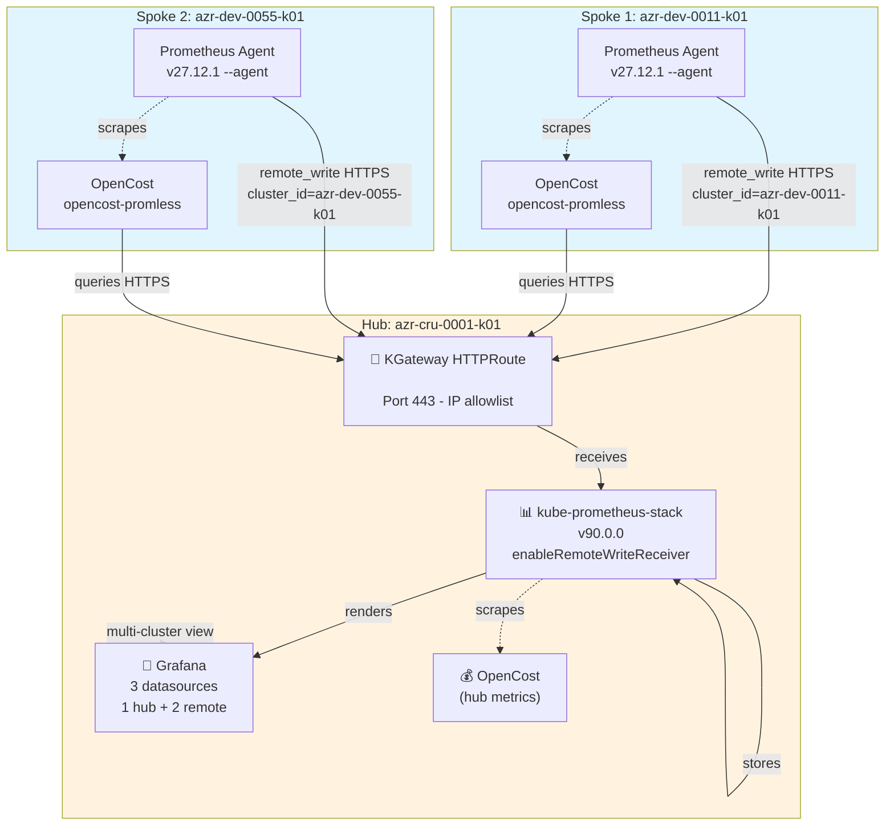

# Observability Hub-Spoke — Prometheus Federation & OpenCost

Documents the multi-cluster observability architecture implemented for the fleet:
a central **hub** that receives metrics from **spokes** via `remote_write`, and
**OpenCost** deployed in dual mode (hub + spoke) for per-cluster cost visibility.

## Topology

| Role | Cluster | Flux branch | Status |
|---|---|---|---|
| Hub (control-plane) | `azr-cru-0001-k01` | `flux` | ✅ Running |
| Spoke (resource-plane) | `azr-dev-0011-k01` | `flux` | ✅ Running |
| Spoke (resource-plane) | `azr-dev-0055-k01` | `flux` | ✅ Running |



## 1. Prometheus federation (hub receives metrics from the spoke)

**Hub** (`apps/overlays/control-plane/prometheus/helmrelease.yaml`):
chart `kube-prometheus-stack` v90.0.0, with:
- `prometheusSpec.enableRemoteWriteReceiver: true` — enables the `/api/v1/write` endpoint to accept remote_write.
- `retention: 24h`, 10Gi PVC.
- Grafana bundled, datasource manually provisioned pointing to `http://prometheus-kube-prometheus-prometheus:9090`.
- Exposed externally via KGateway (`k8s/monitoring/prometheus-httproute.yaml`): `HTTPRoute` on Gateway `pe-gatewayapi`, hostname `<PROMETHEUS_DOMAIN>` → Service `kube-prometheus-stack-prometheus:9090`. LB external IP: `<HUB_LB_IP>`.

**Spoke** (`apps/base/prometheus-agent/helmrelease.yaml`, shared base reused by every spoke):
chart `prometheus` v27.12.1 in **Agent mode** (`--agent`, no local TSDB, no query API):
- `hostAliases` pins `<PROMETHEUS_DOMAIN>` → `<HUB_LB_IP>` (hub's LB IP) — POC workaround to avoid relying on public DNS.
- `global.external_labels`: `cluster_id=${SPOKE_CLUSTER_ID}`, `environment=${SPOKE_ENVIRONMENT}` — stamped onto everything this agent ships via remote_write. Each spoke sets its own `SPOKE_CLUSTER_ID` via Flux `postBuild.substitute` in its `k8s-apps.yaml`.
- `remoteWrite` to `${HUB_PROMETHEUS_WRITE_URL}` (`https://<PROMETHEUS_DOMAIN>/api/v1/write`), TLS `insecure_skip_verify: true`, with `write_relabel_configs` keeping only `up|node_.*|container_.*|kube_.*|kubelet_.*|prometheus_remote_storage_.*` (reduces volume).
- Own scrape jobs: `prometheus` (self), `kubernetes-nodes` / `kubernetes-nodes-cadvisor` (via apiserver proxy), and `kubernetes-service-endpoints` — this last one **auto-discovers any Service annotated with `prometheus.io/scrape=true`**, which is how OpenCost gets scraped without needing a `ServiceMonitor`.

**Onboarded spokes:**

| Cluster | Name | Status | Details |
|---|---|---|---|
| `azr-dev-0011-k01` | spoke | ✅ Running | Victor's spoke, ~1.3M samples/min via remote_write, 0 failures |
| `azr-dev-0055-k01` | spoke2 | ✅ Running | Second spoke (2026-09-16), Prometheus Agent + OpenCost operational |
| `azr-dev-0012-k01` | — | 🔲 Pending | Jonathan's spoke, not yet onboarded |

## 2. OpenCost — dual mode

- **Hub**: OpenCost integrated, queries the hub's local Prometheus.
- **Spoke** (`apps/base/opencost-promless/helmrelease.yaml`, shared base reused by every spoke): standalone OpenCost (`opencost` chart v2.5.30, no UI), queries the **hub's** Prometheus over HTTPS (`opencost.prometheus.external.url: https://<PROMETHEUS_DOMAIN>`).
  - `exporter.defaultClusterId: ${SPOKE_CLUSTER_ID}` + `PROM_CLUSTER_ID_LABEL: cluster_id` — OpenCost adds `cluster_id` as a **real label on its own emitted metrics** at the application level (does not depend on Prometheus `externalLabels`). Same per-spoke `SPOKE_CLUSTER_ID` substitution as the Prometheus agent.
  - `hostAliases` (same DNS workaround as the agent) injected via `postRenderers.kustomize.patches` on the `Deployment`.
  - `prometheus.io/scrape|port|path` annotations injected via `postRenderers.kustomize.patches` on the `Service` — the chart's `values.serviceAnnotations` field does **not** actually apply them to the rendered Service (chart limitation/bug), hence the post-render patch workaround.

**Verified state:** Both spokes (`azr-dev-0011-k01` and `azr-dev-0055-k01`) are sending metrics and cost data to the hub:
- Prometheus remote_write: `prometheus_remote_storage_samples_failed_total=0` for both
- OpenCost: `up{service="opencost-promless",cluster_id="..."}=1` for each spoke
- Grafana: All three clusters visible in multi-cluster dashboards (OpenCost Overview, OpenCost Namespace)
- Network: Both spokes' egress IPs (`<SPOKE2_EGRESS_IP>` for spoke2) added to hub's Gateway allowlist (`pe-gatewayapi`) to permit HTTPS traffic to `<PROMETHEUS_DOMAIN>`

## 3. Known limitation: Grafana can't see the hub's own metrics by `cluster_id`

**Symptom:** in Grafana (datasource = hub's Prometheus), a panel/filter on `cluster_id="azr-cru-0001-k01"` returns no data for the hub's own kube-state-metrics/node-exporter/kubelet metrics. OpenCost, however, correctly distinguishes both clusters.

**Root cause:** Prometheus `externalLabels` are **only applied to metrics leaving** that instance (remote_write, federation, Alertmanager) — **not** to metrics that same instance scrapes and queries locally.

- Hub's native metrics → scraped and queried locally → never go through remote_write → **no `cluster_id`**.
- Spoke's metrics → the agent stamps `cluster_id` **before** shipping them → arrive at the hub already labeled.
- OpenCost → adds `cluster_id` as a real metric label at the application level, regardless of who scrapes it → works the same on both clusters.

**Status:** root cause diagnosed. A previous attempt (`metricRelabelings` on ServiceMonitors) was lost to an accidental `git reset --hard` + `push --force`, and per user confirmation it never showed results in Grafana anyway — that commit was **not** restored.

**Fix applied (new commit, Option A — hardcoded value):** `metricRelabelings` added directly on the hub's `kube-state-metrics` and `prometheus-node-exporter` ServiceMonitors (`apps/overlays/control-plane/prometheus/helmrelease.yaml`), using the CRD's correct camelCase fields (`targetLabel`/`replacement`/`action` — likely why the old attempt silently failed, if it used snake_case):
```yaml
metricRelabelings:
  - targetLabel: cluster_id
    replacement: azr-cru-0001-k01
    action: replace
```
Pending verification directly against Prometheus (`up{cluster_id="azr-cru-0001-k01"}`) after Flux reconciles, before checking Grafana.

## 4. Network Security — IP Allowlist on Gateway

Spokes must route their remote_write and OpenCost queries through the hub's external Gateway (`<PROMETHEUS_DOMAIN>`, IP `<HUB_LB_IP>`). Azure's LoadBalancer service requires explicit IP allowlisting for external traffic.

**Gateway resource:** `k8s/kgateway/main.tf`, `kubernetes_manifest.kgateway_gateway`:
- `spec.infrastructure.annotations["service.beta.kubernetes.io/azure-allowed-ip-ranges"]`: comma-separated list of CIDRs
- Includes Kyndryl VPN CIDR blocks (GlobalProtect), plus per-spoke egress IPs (when spokes are in separate networks/regions)

**Spoke egress IPs (must be added to allowlist):**
- `spoke` (`azr-dev-0011-k01`): `<SPOKE1_EGRESS_IP_1>`, `<SPOKE1_EGRESS_IP_2>`, `<SPOKE1_EGRESS_CIDR>` (added via manual Gateway patch, 2026-09-15)
- `spoke2` (`azr-dev-0055-k01`): `<SPOKE2_EGRESS_IP>` (added via manual Gateway patch, 2026-09-16)

> **Note:** These are currently **live patches** on the `Gateway` resource (not in Terraform source). To make permanent, add to `k8s/kgateway/variables.tf` `allowed_cidrs_vpn` list. For now, patches persist across kgateway controller reconciles (controller propagates Gateway `spec.infrastructure.annotations` → Service `metadata.annotations`).

**How to find a new spoke's egress IP:**
```bash
kubectl run net-debug --rm -it --image=nicolaka/netshoot -- curl ifconfig.me
# Returns: XX.XX.XX.XXX
# Add as XX.XX.XX.XXX/32 to Gateway allowlist
```

## File references

- Hub Prometheus: [platform-fleet-poc/apps/overlays/control-plane/prometheus/helmrelease.yaml](apps/overlays/control-plane/prometheus/helmrelease.yaml)
- Hub HTTPRoute: [k8s/monitoring/prometheus-httproute.yaml](../k8s/monitoring/prometheus-httproute.yaml)
- Spoke Prometheus Agent: [platform-fleet-poc/apps/base/prometheus-agent/helmrelease.yaml](apps/base/prometheus-agent/helmrelease.yaml)
- Spoke OpenCost: [platform-fleet-poc/apps/base/opencost-promless/helmrelease.yaml](apps/base/opencost-promless/helmrelease.yaml)

## Spoke Onboarding Checklist

When onboarding a new spoke cluster, follow these steps **in order** to ensure observability is correctly integrated:

### 1. **Local kubectl context setup** (prerequisite)
```bash
az aks get-credentials --resource-group <rg> --name <aks-cluster> --overwrite-existing
kubectl config rename-context <aks-cluster> <spoke-alias>  # e.g., spoke2
```

### 2. **Add to clusters-config.yaml**
Edit [platform-fleet-poc/clusters-config.yaml](clusters-config.yaml):
```yaml
  - name: azr-dev-0055-k01
    enabled: true
    environment: dev
    sku: sku1
    group: resource-plane
    git_ref_type: branch
    git_ref: flux
    kubeconfig_context: spoke2
    install_flux: true
    flux_namespace: flux-kpc
```

### 3. **Scaffold cluster files**
```bash
cd platform-fleet-poc
./scaffold-cluster-files.sh azr-dev-0055-k01
```
**Edit generated `clusters/non-prod/azr-dev-0055-k01/k8s-apps.yaml`:**
- Fix `HUB_PROMETHEUS_WRITE_URL` (must be external hub URL if spoke is in different network): `https://<PROMETHEUS_DOMAIN>/api/v1/write`
- Verify `SPOKE_CLUSTER_ID` and `SPOKE_ENVIRONMENT` match your cluster's identity

### 4. **Commit & push scaffold**
```bash
git add platform-fleet-poc/clusters/non-prod/azr-dev-0055-k01/
git commit -m "platform-fleet-poc: scaffold azr-dev-0055-k01"
git push origin flux
```

### 5. **Bootstrap Flux**
```bash
export GITHUB_TOKEN=$(gh auth token --hostname github.com --user victorrodriguez1984)
./onboard-clusters.sh azr-dev-0055-k01
```
Flux controller installs, creates `GitRepository` + root `Kustomization` for the cluster.

### 6. **Find spoke's egress IP** (if in different network from hub)
On the spoke cluster:
```bash
kubectl run net-debug --rm -it --image=nicolaka/netshoot -- curl ifconfig.me
# Record the output IP (e.g., 20.237.40.112)
```

### 7. **Add spoke's IP to hub's Gateway allowlist**
On the hub cluster, patch the `Gateway` resource:
```bash
kubectl config use-context hub
CURRENT=$(kubectl get gateway pe-gatewayapi -n gatewayapi -o jsonpath='{.spec.infrastructure.annotations.service\.beta\.kubernetes\.io/azure-allowed-ip-ranges}')
NEW="${CURRENT},<SPOKE2_EGRESS_IP>"
kubectl patch gateway pe-gatewayapi -n gatewayapi --type merge -p "{\"spec\":{\"infrastructure\":{\"annotations\":{\"service.beta.kubernetes.io/azure-allowed-ip-ranges\":\"${NEW}\"}}}}"
```
The kgateway controller propagates this to the LoadBalancer Service automatically (takes ~1-2 min).

### 8. **Verify data flow**
Back on the spoke:
```bash
kubectl config use-context spoke2
# Wait for Prometheus Agent and OpenCost pods to be Running
kubectl get pods -n monitoring -n finops
# Test hub connectivity from spoke
kubectl run net-debug --rm -it --image=nicolaka/netshoot -- curl -I https://<PROMETHEUS_DOMAIN>/
```

On the hub:
```bash
kubectl config use-context hub
# Check that spoke's metrics arrive
kubectl exec -n monitoring prometheus-kube-prometheus-stack-prometheus-0 -- \
  promtool query instant 'up{cluster_id="azr-dev-0055-k01"}'
```

### 9. **Verify in Grafana**
- Cluster dropdown in OpenCost dashboards should list the new spoke
- Namespace filtering should show spoke's namespaces
- Cost data should appear within ~2-3 minutes

**Done!** The spoke is fully integrated and contributing metrics/cost data to the hub.
