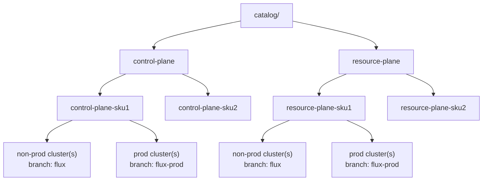

# Platform Fleet POC - GitOps Multi-Cluster (Flux)

POC to manage a Kubernetes fleet with Flux CD v2 using **a single cluster inventory** and **branch-based promotion**.

Practical target:
- `non-prod` validates on `flux`.
- `prod` consumes `flux-prod`.
- The codebase is the same; the only difference is the branch each cluster tracks.

## Key decisions

1. Single cluster inventory in `clusters-config.yaml`.
2. Promotion by branches (`flux` -> `flux-prod`), not tags.
3. `enabled` and `install_flux` are **onboarding** flags (script), not runtime switches.
4. At runtime, the in-cluster `GitRepository` (`flux-kpc`) is authoritative.
5. Flux and component versions are governed from `catalog/`.

## Repository structure

```text
platform-fleet-poc/
├── clusters-config.yaml
├── onboard-clusters.sh
├── catalog/
│   ├── flux.yaml
│   ├── prometheus.yaml
│   ├── opencost.yaml
│   ├── podinfo.yaml
│   ├── whoami.yaml
│   ├── promote-flux-release.sh
│   └── promote-app-release.sh
├── clusters/
│   ├── non-prod/
│   │   ├── azr-cru-0001-k01/
│   │   └── kind-dev/
│   └── prod/
├── infrastructure/
│   ├── base/
│   ├── overlays/
│   └── sources/
└── apps/
    ├── base/
    └── overlays/
```

## Simple model (catalog -> clusters -> sku)



Interpretation:
- `catalog/` defines validated versions.
- `group` selects what runs.
- `sku` selects size/profile.
- cluster branch (`flux` or `flux-prod`) selects release channel.

## What each layer deploys

### 1) Cluster entrypoint (`clusters/<env>/<name>/`)
- `kustomization.yaml`: cluster entrypoint (includes `flux-kpc`, `infrastructure.yaml`, `k8s-apps.yaml`).
- `infrastructure.yaml`: platform Kustomization (namespaces, RBAC, HelmRepository, etc.).
- `k8s-apps.yaml`: workloads/add-ons Kustomization.

### 2) Infrastructure (`infrastructure/`)
- `base/`: common resources.
- `overlays/<group>-<sku>`: profile by group and size.

### 3) Apps/Add-ons (`apps/`)
- `base/`: catalog of potential apps (for example `whoami`, `podinfo`).
- `overlays/<group>-<sku>`: which apps/add-ons are actually enabled per group.

In the current state, `control-plane` enables Prometheus and OpenCost from:
- `apps/overlays/control-plane/prometheus/`
- `apps/overlays/control-plane/opencost/`

## Branches and release

Recommended model:
- `flux`: integration and non-prod validation.
- `flux-prod`: stable branch for prod.

Flow:
1. Merge work into `flux`.
2. Validate in non-prod.
3. Promote with merge `flux` -> `flux-prod`.
4. Clusters tracking `flux-prod` apply that snapshot.

Important:
- Two branches **do scale** when they are two channels of the same code.
- What does not scale is maintaining manually divergent inventories/code.

## `clusters-config.yaml`: field meaning

- `group`: what stack runs (`control-plane`, `resource-plane`, etc.).
- `sku`: capacity variant inside the group (`sku1`, `sku2`, ...).
- `environment`: path mapping (`prod` -> `clusters/prod`, anything else -> `clusters/non-prod`).
- `git_ref`: branch tracked by that cluster (`flux` or `flux-prod`).
- `enabled`: whether onboarding script should process that cluster.
- `install_flux`: whether onboarding script should bootstrap/verify Flux for that cluster.

Operational note:
- Changing `enabled` or `install_flux` does **not stop** reconciliation on an already-bootstrapped cluster.
- Runtime follows whatever is configured in the in-cluster `GitRepository/flux-kpc`.

## Bootstrap and day-2 operations

```bash
# Initial bootstrap (onboarding)
./platform-fleet-poc/onboard-clusters.sh

# Flux state
kubectl get gitrepositories,kustomizations -n flux-kpc -o wide
kubectl get pods -n flux-kpc
flux check

# Manual reconcile
flux reconcile source git flux-kpc -n flux-kpc
flux reconcile kustomization flux-kpc -n flux-kpc --with-source
flux reconcile kustomization infrastructure -n flux-kpc --with-source
flux reconcile kustomization apps -n flux-kpc --with-source
```

## How to run setup

Use this flow for first-time onboarding or when adding a new cluster entry.

```bash
# 1) export token used by flux bootstrap
export GITHUB_TOKEN=<your_token>

# 2) run onboarding for all enabled clusters
./platform-fleet-poc/onboard-clusters.sh

# 3) or run onboarding for one cluster only
./platform-fleet-poc/onboard-clusters.sh <cluster-name>

# 4) verify
kubectl get gitrepositories,kustomizations -n flux-kpc -o wide
kubectl get pods -n flux-kpc
```

Notes:
- `enabled` and `install_flux` are onboarding flags for this script.
- For already-bootstrapped clusters, runtime reconciliation is controlled by Flux CRs in-cluster, not by rerunning setup.

## Version promotion

### Flux controllers
1. Update `catalog/flux.yaml` (`validated.<group>`).
2. Run:
```bash
./platform-fleet-poc/catalog/promote-flux-release.sh <group>
```
3. Validate in `flux`.
4. Promote to prod with merge `flux` -> `flux-prod`.

### Cataloged apps
For image-based apps:
```bash
./platform-fleet-poc/catalog/promote-app-release.sh <app> <group>
```

## How to release

### Release Flux controllers

```bash
# 1) update validated.<group> in catalog/flux.yaml

# 2) render + commit Flux manifest upgrade for that group
./platform-fleet-poc/catalog/promote-flux-release.sh <group>

# 3) validate on non-prod (flux branch)
flux reconcile source git flux-kpc -n flux-kpc
flux reconcile kustomization flux-kpc -n flux-kpc --with-source

# 4) promote to prod channel
git checkout flux-prod
git merge --ff-only flux
git push
```

### Release one application

```bash
# 1) update validated.<group> in catalog/<app>.yaml

# 2) apply catalog promotion for that app/group
./platform-fleet-poc/catalog/promote-app-release.sh <app> <group>

# 3) validate on non-prod
flux reconcile source git flux-kpc -n flux-kpc
flux reconcile kustomization apps -n flux-kpc --with-source

# 4) promote to prod channel
git checkout flux-prod
git merge --ff-only flux
git push
```

## Short troubleshooting guide (recommended order)

### 1) Non-disruptive checks
```bash
kubectl get kustomizations -n flux-kpc -o wide
kubectl get kustomization apps -n flux-kpc -o yaml | sed -n '/inventory:/,$p'
kubectl describe kustomization apps -n flux-kpc | tail -40
kubectl logs -n flux-kpc deployment/kustomize-controller --tail=200
```

### 2) Controlled reconcile
```bash
flux reconcile source git flux-kpc -n flux-kpc
flux reconcile kustomization apps -n flux-kpc --with-source
```

### 3) Typical case: "Ready but not deleting"
If `apps` is `Ready=True` but old resources still exist:
- inspect Kustomization `inventory`;
- if objects are not in `inventory`, they are historical leftovers (orphans);
- `prune` only deletes resources that the current inventory can track.

## OpenCost in this repository

OpenCost is deployed with HelmRelease at `apps/overlays/control-plane/opencost/helmrelease.yaml`.

Current mode:
- In-cluster Prometheus dependency.
- GitOps-managed configuration (avoid permanent runtime manual edits).

Next phase (enterprise environments):
1. Add read-only cloud credentials.
2. Control egress to private cloud APIs.
3. Compare estimated cost vs real billing.

## Minimum governance recommended

1. Mandatory PR for `flux-prod`.
2. CODEOWNERS for `catalog/`, `clusters/`, and critical overlays.
3. Prod rollback with `git revert` on `flux-prod`.

## Production usage (go-live checklist)

Use this checklist before treating the platform as production-ready.

### Mandatory (must-have)

1. All production clusters track `flux-prod` (not `flux`).
2. `flux-prod` is protected: PR required, no direct push.
3. Release path is enforced: validate on `flux` first, then promote to `flux-prod`.
4. Rollback is documented and tested (`git revert` on `flux-prod` + reconcile).
5. Secrets and cloud credentials are managed securely (no hardcoded values).
6. Flux health is continuously monitored (`GitRepository`, `Kustomization`, controller pods).

### Recommended (strongly advised)

1. CI checks for YAML/Kustomize/schema before merge.
2. Audit trail for every production promotion (PR + approval + release note).
3. On-call runbook for failed reconcile, drift, and orphan cleanup.
4. Periodic disaster-recovery test (restore cluster + reconcile from Git).
5. OpenCost validation against real billing data before cost-based decisions.

### Nice-to-have (next step)

1. Progressive promotion waves by cluster group.
2. Automated policy checks (RBAC/network/security baselines).
3. SLO dashboard for reconciliation latency and failure rate.

### Production release flow (short)

```bash
# 1) validate in non-prod channel
git checkout flux
# merge feature PRs, then validate
flux reconcile source git flux-kpc -n flux-kpc
flux reconcile kustomization apps -n flux-kpc --with-source
flux reconcile kustomization infrastructure -n flux-kpc --with-source

# 2) promote exact snapshot to prod channel
git checkout flux-prod
git merge --ff-only flux
git push

# 3) verify in prod clusters
kubectl get gitrepositories,kustomizations -n flux-kpc -o wide
```
