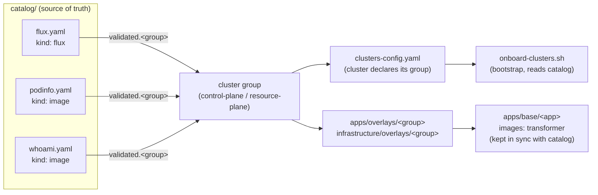

# Platform Fleet POC - Flux v2 & Cluster Onboarding

This is a Proof of Concept (POC) for **automated, GitOps-based Kubernetes fleet management** using Flux CD v2. One Git repository (this one, branch-based) is the single source of truth for what runs on every cluster in the fleet; each cluster continuously pulls and reconciles its own desired state from Git - nobody ever runs `kubectl apply` by hand against a cluster.

## Why GitOps / why Flux

- **Pull-based, not push-based**: clusters pull their config from Git on an interval (no CI system needs network access *into* the cluster, which is a much smaller attack surface than a push-based pipeline with cluster credentials).
- **Git is the audit log**: every change to any cluster's state is a commit, reviewable via PR, revertible via `git revert`.
- **Self-healing**: if someone manually changes something in-cluster (drift), Flux reconciles it back to what Git says on the next interval.
- **Multi-cluster at scale**: one repo, one bootstrap script, N clusters - each cluster only reads its own `clusters/<prod|non-prod>/<name>/` folder.

## What Flux actually installs (the pods you'll see)

`flux bootstrap` installs these controllers as Deployments (1 pod each) in the namespace you choose (here: `flux-kpc`):

| Controller | What it watches | What it does |
|---|---|---|
| `source-controller` | `GitRepository`, `HelmRepository`, `Bucket` CRs | Clones/polls the Git repo (or Helm repo/bucket) on `spec.interval`, produces a versioned artifact (tarball) other controllers consume. This is the only controller that ever talks to GitHub. |
| `kustomize-controller` | `Kustomization` CRs | Takes the artifact from a `GitRepository`, runs `kustomize build` on `spec.path`, and applies the resulting manifests to the cluster. Supports `dependsOn` (e.g. `apps` waits for `infrastructure`) and `prune: true` (deletes resources removed from Git). |
| `helm-controller` | `HelmRelease` CRs | Installs/upgrades Helm charts sourced from a `HelmRepository`/`GitRepository`. Not used yet in this POC (no `HelmRelease` objects defined), but installed by default. |
| `notification-controller` | `Alert`/`Provider`/`Receiver` CRs | Sends reconciliation events to external systems (Slack, webhooks) and can receive push-triggered reconciliation requests. Not configured yet, installed by default. |

Check what's actually running at any time:
```bash
kubectl get pods -n flux-kpc
kubectl get gitrepositories,kustomizations -n flux-kpc -o wide
```

### How self-management works (the `flux-kpc` folder)

`flux bootstrap` also commits a `clusters/<prod|non-prod>/<name>/flux-kpc/` folder back into this repo containing:
- `gotk-components.yaml` - the controllers themselves (CRDs, RBAC, Deployments) - this is what gets swapped out on a Flux version upgrade.
- `gotk-sync.yaml` - a `GitRepository` + `Kustomization` (both named after the namespace, e.g. `flux-kpc`) that make Flux track and re-apply **this same repo** going forward - including its own future upgrades. This is why bootstrap only needs to run once; after that, Flux manages itself via Git.

These files are marked "DO NOT EDIT" because `flux bootstrap` regenerates them - but they're plain Kubernetes manifests, so hand-editing (e.g. fixing `spec.path` after a directory rename) is safe when needed; the next real bootstrap run will just regenerate them from the same inputs.

## Repository layout

```
platform-fleet-poc/
├── clusters-config.yaml        # Central config: WHAT + WHEN + WHICH VERSION per cluster
├── onboard-clusters.sh          # Reads clusters-config.yaml, runs `flux bootstrap` per cluster
├── catalog/                     # Source of truth for "validated" - see Catalog hierarchy below
│   ├── flux.yaml                 # kind: flux  - flux_version per group
│   ├── podinfo.yaml               # kind: image - registry/repository/tag per group
│   ├── whoami.yaml                 # kind: image - registry/repository/tag per group
│   ├── promote-flux-release.sh     # git-commit-only trigger: catalog -> gotk-components.yaml
│   └── promote-app-release.sh      # git-commit-only trigger: catalog -> apps/base/<app> images:
├── clusters/
│   ├── non-prod/<name>/         # kind-dev, aks-dev - flux-kpc/, infrastructure.yaml, apps.yaml
│   └── prod/<name>/             # prod clusters (none onboarded yet)
├── infrastructure/
│   ├── base/                    # Full catalog: namespaces, RBAC, cluster-wide add-ons
│   ├── overlays/{control-plane,resource-plane}/  # Which base pieces each group gets
│   │   ├── resource-plane-sku1/  # Sizing profile: pass-through (sibling, not nested - see below)
│   │   └── resource-plane-sku2/  # Sizing profile: worked example (higher replica count)
│   └── sources/                 # Shared HelmRepository/GitRepository sources
└── apps/
    ├── base/{whoami,podinfo,external-secrets-operator}/  # Full app catalog
    └── overlays/{control-plane,resource-plane}/           # Which apps each group gets
        ├── resource-plane-sku1/  # Sizing profile: pass-through
        └── resource-plane-sku2/  # Sizing profile: whoami replicas: 5
```

Each `clusters/<prod|non-prod>/<name>/infrastructure.yaml` and `apps.yaml` is a Flux `Kustomization` pointing `sourceRef` at `flux-kpc` and `path` at the group+sku overlay (`infrastructure/overlays/<group>-<sku>` / `apps/overlays/<group>-<sku>`, e.g. `resource-plane-sku1`). `apps` has `dependsOn: [infrastructure]`, so apps only get applied once infra is healthy.

## Architecture decisions

### 1. `group` (control-plane / resource-plane) → WHAT a cluster runs
Every cluster declares a `group` in `clusters-config.yaml`. The group name must match a folder under `infrastructure/overlays/<group>/` and `apps/overlays/<group>/`. This is pure Kustomize overlay composition - no Flux-specific magic, just "which subset of the catalog does this class of cluster get".

### 2. Promotion is branch-only → WHEN a cluster picks up changes
`git_ref_type` is always `branch`; `git_ref` is the branch name a cluster tracks:
- `environment: dev` → `git_ref: flux` (fast-moving, latest commit)
- `environment: prod` → `git_ref: flux-prod` (a separate long-lived branch, only fast-forwarded/merged from `flux` when a change has been validated on dev)

Promoting to prod: `git checkout flux-prod && git merge flux && git push`.

**We evaluated and rejected tag/semver-based promotion.** The original design used a second, hand-authored `GitRepository` (`fleet-source`) pinned to a git tag/semver range, so a cluster would only pick up a manually-promoted, known-good snapshot instead of every commit on a branch. In practice this hit a real, reproducible bug: Flux's `source-controller` (go-git) fails to checkout **annotated** tags (`git tag -a`, the kind `git tag` creates by default) with `unable to checkout tag 'vX.Y.Z': worktree contains unstaged changes` - restarting the controller pod did not fix it. Rather than depend on lightweight tags only (fragile, easy to get wrong) or debug a third-party library bug, we moved the same "promote only when ready" guarantee to branches instead, which Flux supports natively and robustly.

### 3. `clusters/prod/` vs `clusters/non-prod/` → where a cluster's manifests live
Derived automatically from `environment` in `onboard-clusters.sh` (`prod` → `clusters/prod/<name>/`, anything else → `clusters/non-prod/<name>/`). No separate path field to keep in sync - one less place to make a mistake.

### 4. `sku` (sku1 / sku2 / ...) → HOW MUCH a cluster runs, within a group

A `group` (control-plane / resource-plane) says *which* base infra + apps a cluster gets. It doesn't say *how big*. Real fleets rarely have just one flavor of "resource-plane" - some spoke clusters are small dev sandboxes, others need more replicas/resources for load testing, without being a different `group` (they still run the exact same set of apps/infra). `sku` is that second, independent axis, layered *inside* a group:

```
infrastructure/overlays/resource-plane/        # the group overlay - common to every sku
infrastructure/overlays/resource-plane-sku1/   # -> resources: [../resource-plane]  (pass-through)
infrastructure/overlays/resource-plane-sku2/   # -> resources: [../resource-plane]  (+ patches)
```

`clusters-config.yaml` gets a `sku` field alongside `group`; a cluster's `infrastructure.yaml`/`apps.yaml` `path` points at `overlays/<group>-<sku>` instead of just `overlays/<group>`. Two things worth calling out:

- **Naming is flat/hyphenated (`resource-plane-sku1`), never nested (`resource-plane/sku1`).** Kustomize's loader refuses to build an overlay that lives inside the very directory it lists as a `resources:` entry - it flags it as a cycle (`cycle detected: candidate root '.../resource-plane' contains visited root '.../resource-plane/sku1'`), verified empirically while building this out. Sku overlays must be siblings of the group overlay, referencing `../<group>`.
- **A sku overlay only ever adds what's different**, using Kustomize's own transformers - e.g. `replicas:` to bump a replica count (see `apps/overlays/resource-plane-sku2`, which bumps `whoami` to 5 replicas vs. the base's 3) - never a copy of the underlying manifest. `resource-plane-sku2` today is a worked example only (no cluster uses it yet); `resource-plane-sku1` is what `kind-dev`/`aks-dev` actually run, and it's a pure pass-through (no differences from the group overlay yet).

This scales the same way `group` does: the number of overlay folders grows with `groups × skus` (a small, fixed set of profiles), never with the number of clusters - N clusters can share one `group`+`sku` combination.

### 5. Version catalog, per group → decoupling in-cluster Flux from the operator's laptop
`flux bootstrap` without `--version` installs whatever toolkit version matches the locally-installed `flux` CLI binary. That means a `brew upgrade flux` on someone's machine, followed by an unrelated re-run of the onboarding script, could silently upgrade a cluster's Flux controllers - including prod - with zero review. Instead of a `flux_version` field hand-copied onto every cluster in `clusters-config.yaml` (one more place to forget to update, and no shared "this is the version we've actually validated" concept), the Flux version lives in one place: [`catalog/flux.yaml`](catalog/flux.yaml). It defines named `releases` (today: just a Flux version, but the shape is a map so a release can grow to bundle more later) and a `validated` map pointing each cluster `group` at the release it's currently pinned to. `onboard-clusters.sh` only ever *reads* this file (to bootstrap a brand-new cluster); it never writes to it and never upgrades an already-bootstrapped cluster.

Upgrading is a separate, explicit act: bump `validated.<group>` in the catalog, then run `catalog/promote-flux-release.sh <group>`. That script never touches a cluster - it re-renders `gotk-components.yaml` locally via `flux install --export` (a pure manifest-templating call, no cluster/network contact) and commits+pushes the result. The actual upgrade happens when each cluster's own already-running `flux-kpc` self-management `Kustomization` reconciles that commit on its normal interval (or immediately via `flux reconcile kustomization flux-kpc -n <namespace> --with-source`) - a pull, not a push. Validate on a non-prod group first, then merge `flux` → `flux-prod` to carry the same validated release to prod groups.

### 6. Per-cluster, self-managed Flux → **we evaluated and rejected hub/spoke (remote cluster) management**

Every onboarded cluster (`kind-dev`, `aks-dev`, and any future one) bootstraps and self-manages **its own** Flux instance - its own `flux-kpc` namespace, its own `GitRepository`, its own `infrastructure`/`apps` `Kustomization`s pulling from this repo. That's why a physical, per-cluster folder under `clusters/<prod|non-prod>/<name>/` is required (see the folder-layout discussion above): each cluster's self-management `Kustomization` has a static `path` baked in at bootstrap time, and there's no cross-cluster templating at the Flux CR level in this model.

**The alternative we looked at**: a hub/spoke ("remote cluster") setup, where Flux is installed **once**, in a hub (`control-plane`) cluster, and that single hub Flux manages every spoke remotely via `Kustomization.spec.kubeConfig.secretRef` pointing at each spoke's kubeconfig. This is a real, supported Flux pattern, and it would remove the per-spoke Flux install + most of the per-cluster folder duplication (many spokes with identical `group`/`sku` could share far more of their definition, generated/templated from one list instead of N bootstrapped instances).

**Why we didn't adopt it (for now)**:
- **It re-introduces exactly the risk GitOps/Flux was chosen to avoid.** The whole rationale in "Why GitOps / why Flux" above is pull-based reconciliation with no external system holding push credentials into a cluster. Hub/spoke flips that for the hub itself: it has to hold live API credentials (kubeconfigs) for *every* spoke, so a compromised hub is a compromised fleet - a much bigger blast radius than today's model, where compromising one cluster's `flux-kpc` only affects that one cluster.
- **Not needed at this scale.** With 1-2 non-prod clusters and no prod cluster onboarded yet, the maintenance pain hub/spoke would solve (N nearly-identical per-cluster folders) isn't real yet - it's cheaper to solve that specific problem by generating the per-cluster boilerplate from `clusters-config.yaml` (see folder-layout discussion) than to change the trust model of the whole fleet.
- **Revisit trigger**: if the fleet grows to a size where per-cluster-folder duplication is genuinely painful even after generating it from the config list, or if there's a real need for centralized fleet operations (e.g. a Rancher/ArgoCD-ApplicationSet-style controller), hub/spoke is the natural next step - and it's exactly the role already reserved conceptually for the `control-plane` group. Not ruled out permanently, just not justified yet.

## Catalog hierarchy - the enterprise control this repo is built around

**The catalog is the only place "validated" / "usable" is decided. Everything else in this repo only ever *points into* the catalog - nothing else is allowed to independently decide what version of anything is good.**



Every catalog file, regardless of what it catalogues, follows the same two-part shape:
- `releases`: every version/image that has ever existed as a candidate (a named, immutable historical record - never delete an entry, a rollback is just pointing `validated` at an older one).
- `validated`: a map of `group -> release id` - the **only** mutable pointer, and the only thing a promotion (`catalog/promote-flux-release.sh` / `catalog/promote-app-release.sh`) ever changes. "Validated" always means *reconciled and all checks green on a non-prod cluster in that group* - never just "someone typed a new version".

What differs between catalog files is only **`kind`** - what a release actually pins, because different delivery mechanisms need different data:

| `kind` | Used by | What a release pins | Why |
|---|---|---|---|
| `flux` | [`catalog/flux.yaml`](catalog/flux.yaml) | `flux_version` + a top-level `registry`/`images` list (repository names only, no tags) | Installed via `flux install`/`flux bootstrap`, which resolves each controller's own image tag internally for the given version (4 controllers, 4 independent tags that don't match `flux_version` 1:1) - hand-pinning those tags here would drift; the resolved tags always live in the committed `gotk-components.yaml` per cluster. |
| `image` | [`catalog/podinfo.yaml`](catalog/podinfo.yaml), [`catalog/whoami.yaml`](catalog/whoami.yaml) | `registry` + `repository` + `tag` (or `digest`) | Plain Kubernetes `Deployment`, no Helm chart in the loop - the catalog itself is the only record of which container image is actually running. |
| `helm` | *(none yet - reserved)* | chart `version` only | A `HelmRelease` + `HelmRepository` resolve the actual container image(s) internally, so pinning one separately here would be redundant - only the chart version needs pinning. |

Nothing downstream is allowed to hardcode a version that isn't traceable back to one of these files: `clusters-config.yaml` only declares a `group`, and `onboard-clusters.sh`/`promote-*.sh` are the only code that ever reads a catalog file's `validated` pointer to resolve an actual version. This is what makes promotion an auditable, one-line-diff act instead of a hunt through raw manifests.

### Applications catalog: implemented, not just proposed
[`catalog/podinfo.yaml`](catalog/podinfo.yaml) and [`catalog/whoami.yaml`](catalog/whoami.yaml) are real, in use today - `kind: image`, pinned to real public Docker Hub tags (`stefanprodan/podinfo:6.14.1`, `traefik/whoami:v1.11.0`), consumed by `apps/base/<app>/kustomization.yaml`'s `images:` transformer (which is what actually controls the running tag - the tag inside `deployment.yaml` itself is a placeholder Kustomize overrides). [`catalog/promote-app-release.sh <app> <group>`](catalog/promote-app-release.sh) is the same git-commit-only promotion trigger as `promote-flux-release.sh`, generalized for both `kind`s - **it's a nice-to-have convenience on top of the catalog, not the control itself**: the real control is that the catalog file is the only source of truth for the version, whether or not you use the script to edit it.

**Does this scale?** Yes, for the dimension that actually matters: the number of *independently-versioned things*, not the number of clusters. One file per app/thing keeps release history in its own small, low-conflict diff, and a cluster's actual version is still just one pointer lookup (`validated.<group>`) regardless of how many clusters share that group. What this doesn't solve by itself yet - see "Future needs" below.

## Future needs (known gaps, out of scope for this POC/HLD)

This POC intentionally stops at "enough to prove the GitOps + catalog control model end-to-end with public images". The following are real gaps for anything beyond that, called out explicitly so they aren't mistaken for oversights:

- **Private registry credentials (`imagePullSecrets`)**: every image today is public (Docker Hub) - nothing in this repo pulls a secret to authenticate to a registry yet. Once a private/internal registry is in the picture, the natural extension is an optional field per `kind: image` catalog entry (e.g. `pullSecret: <k8s-secret-name>`), referenced by the app's `Deployment.spec.imagePullSecrets` (or centrally via the namespace's default `ServiceAccount`). The secret itself shouldn't be committed to Git in any form - this is exactly what the already-placeholder [`apps/base/external-secrets-operator`](apps/base/external-secrets-operator) is for (sync it from a real secret store rather than hand-creating `kubectl create secret docker-registry`), so wiring registry credentials through should piggy-back on that once it's built out, not invent a second mechanism.
- **Helm `values` management for `kind: helm` releases**: no `HelmRelease` exists yet, but once one does, the catalog's `helm` entries will need to carry (or point at) per-group `values` overrides too, not just a chart `version` - likely `HelmRelease.spec.values` inline for small cases, or `valuesFrom` a `ConfigMap`/`Secret` per group for anything non-trivial. Not designed yet.
- **Air-gapped / offline delivery (packaging as `.tgz` or mirroring images)**: this POC assumes clusters can reach the public internet (Docker Hub, GHCR, the Flux install source) directly. A disconnected environment would need charts packaged via `helm package` and images mirrored into a reachable registry (e.g. `skopeo`/`crane`/`helm push` to an OCI registry, or a bundling tool like Zarf/Hauler) - the catalog's `registry`/`repository` fields are exactly what such a mirroring step would need to read and rewrite, but no mirroring automation exists today.
- **Catalog schema validation in CI**: still just an idea (see the `kind`/`releases`/`validated` shape above) - a malformed catalog file would currently fail silently or late (inside a promote script) rather than at PR time. A lightweight CI check (`yq`/JSON-schema per `kind`) should validate every `catalog/**/*.yaml` before merge.
- **Registry-watching automation**: `releases` entries are hand-typed today. At real scale, a tool that watches the registry (Flux's own `ImageRepository`/`ImagePolicy`/`ImageUpdateAutomation` controllers, or Renovate) should propose new `releases` as PRs when a new image/chart version is published - a human should only ever move the `validated` pointer, never hand-type a tag or digest.


```bash
# 1. Set GitHub token (needs repo read/write on victorrodriguez1984/kubernetes-ready)
export GITHUB_TOKEN=your_token

# 2. Edit cluster configuration (enable clusters, set group/environment/git_ref/flux_version)
vi platform-fleet-poc/clusters-config.yaml

# 3. Run onboarding script (installs Flux v2 via bootstrap, idempotent)
./platform-fleet-poc/onboard-clusters.sh                  # all enabled clusters
./platform-fleet-poc/onboard-clusters.sh kind-dev          # just one cluster
./platform-fleet-poc/onboard-clusters.sh kind-dev --force  # force reinstall
```

See [SETUP.md](SETUP.md) for more detailed step-by-step instructions (note: predates the `environment`/branch-promotion/`flux_version` fields described above - `clusters-config.yaml`'s own header comments are the source of truth for the current schema).

## Verification

```bash
kubectl get gitrepositories,kustomizations -n flux-kpc -o wide   # all should be READY: True
kubectl get pods -n flux-kpc                                     # 4 controller pods running
flux check                                                        # controller health + version
```

## Governance

- **Ownership**: [`.github/CODEOWNERS`](../.github/CODEOWNERS) documents which paths belong to which owner. Currently everyone maps to a single owner (no team split yet), but the granularity (per-cluster, per-overlay, shared `base/`) is already in place so splitting review responsibility later is a one-line change per row.
- **Promotion is branch-only**: every cluster's `git_ref_type` is `branch`; dev clusters track the `flux` branch, prod clusters track the `flux-prod` branch (`clusters-config.yaml`'s `git_ref` field). Promoting to prod means merging/fast-forwarding `flux` into `flux-prod` (`git checkout flux-prod && git merge flux && git push`) once changes are validated on dev - see the comments at the top of `clusters-config.yaml` for the full mechanism.
- **Folder layout**: `clusters/non-prod/<name>/` for dev-type clusters, `clusters/prod/<name>/` for prod-type clusters - derived automatically from each cluster's `environment` field, see `onboard-clusters.sh`.
- **Branch protection** on `flux-prod` (restricting direct pushes, requiring PR review before merge) is the recommended way to gate prod promotion once ready to enforce it - check repo Settings > Branches. Note: the classic tag-protection/rulesets API 403'd for this repo ("Upgrade to GitHub Pro or make this repository public") - branch protection rules may have the same private-repo/free-plan restriction, so verify availability before relying on it; until confirmed, promotion discipline is by convention/CODEOWNERS review only.


- **Ownership**: [`.github/CODEOWNERS`](../.github/CODEOWNERS) documents which paths belong to which owner. Currently everyone maps to a single owner (no team split yet), but the granularity (per-cluster, per-overlay, shared `base/`) is already in place so splitting review responsibility later is a one-line change per row.
- **Promotion is branch-only**: every cluster's `git_ref_type` is `branch`; dev clusters track the `flux` branch, prod clusters track the `flux-prod` branch (`clusters-config.yaml`'s `git_ref` field). Promoting to prod means merging/fast-forwarding `flux` into `flux-prod` (`git checkout flux-prod && git merge flux && git push`) once changes are validated on dev - see the comments at the top of `clusters-config.yaml` for the full mechanism.
- **Folder layout**: `clusters/non-prod/<name>/` for dev-type clusters, `clusters/prod/<name>/` for prod-type clusters - derived automatically from each cluster's `environment` field, see `onboard-clusters.sh`.
- **Branch protection** on `flux-prod` (restricting direct pushes, requiring PR review before merge) is the recommended way to gate prod promotion once ready to enforce it - check repo Settings > Branches. Note: the classic tag-protection/rulesets API 403'd for this repo ("Upgrade to GitHub Pro or make this repository public") - branch protection rules may have the same private-repo/free-plan restriction, so verify availability before relying on it; until confirmed, promotion discipline is by convention/CODEOWNERS review only.

