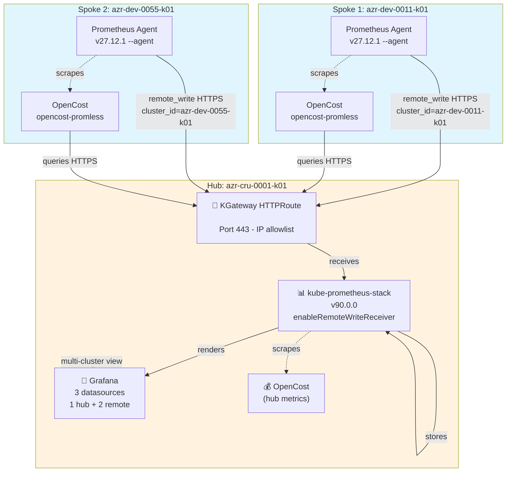
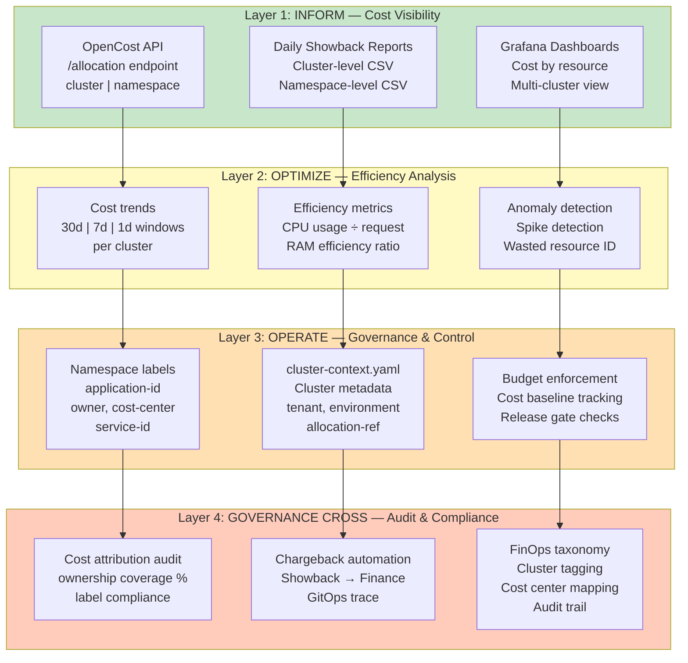
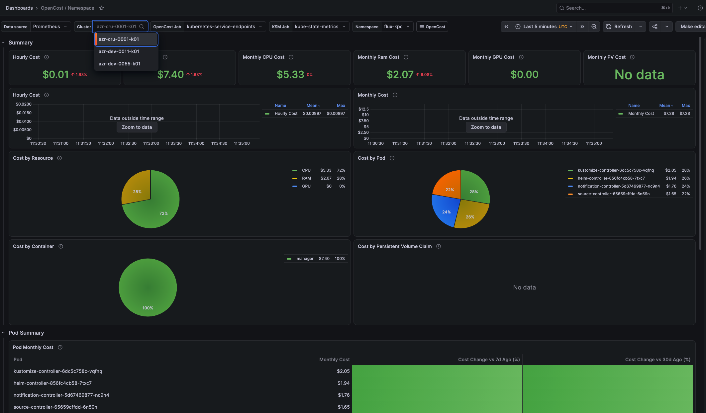

# Observability Hub-Spoke — Prometheus Federation & OpenCost

Documents the multi-cluster observability architecture implemented for the fleet:
a central **hub** that receives metrics from **spokes** via `remote_write`, and
**OpenCost** deployed in dual mode (hub + spoke) for per-cluster cost visibility.

## Topology

| Role | Cluster | Flux branch | Status |
|---|---|---|---|
| Hub (control-plane) | `azr-cru-0001-k01` | `flux` | ✅ Running |
| Spoke (resource-plane) | `azr-dev-0011-k01` | `flux` | ✅ Running |
| Spoke (resource-plane) | `azr-dev-0055-k01` | `flux` | ✅ Running |



## 1. Prometheus Federation (Hub receives metrics from spokes)

**Hub** (`apps/overlays/control-plane/prometheus/helmrelease.yaml`):
- Chart `kube-prometheus-stack` v90.0.0, with `prometheusSpec.enableRemoteWriteReceiver: true` (enables `/api/v1/write` endpoint).
- Retention: 24h, 10Gi PVC.
- Grafana bundled with datasource provisioned → `http://prometheus-kube-prometheus-prometheus:9090`.
- Exposed externally via **KGateway** `HTTPRoute` on `<PROMETHEUS_DOMAIN>` → LB IP `<HUB_LB_IP>`.

**Spoke** (`apps/base/prometheus-agent/helmrelease.yaml`, shared base):
- Chart `prometheus` v27.12.1 in **Agent mode** (`--agent`, no TSDB, no query API).
- `global.external_labels`: `cluster_id=${SPOKE_CLUSTER_ID}`, `environment=${SPOKE_ENVIRONMENT}`.
- `remoteWrite` to `https://<PROMETHEUS_DOMAIN>/api/v1/write` with TLS `insecure_skip_verify: true`.
- Scrape jobs: `prometheus` (self), `kubernetes-nodes`, `kubernetes-service-endpoints` (auto-discovers services annotated `prometheus.io/scrape=true`).

**Onboarded Spokes:**

| Cluster | Name | Status | Volume |
|---|---|---|---|
| `azr-dev-0011-k01` | spoke1 | ✅ Running | ~1.3M samples/min remote_write |
| `azr-dev-0055-k01` | spoke2 | ✅ Running | Agent + OpenCost operational |
| `azr-dev-0012-k01` | — | 🔲 Pending | Jonathan's cluster (future) |

## 2. OpenCost — Dual Mode

- **Hub**: Full mode, queries local Prometheus.
- **Spoke** (`apps/base/opencost-promless/helmrelease.yaml`): Promless mode, queries hub's Prometheus over HTTPS.
  - `externalUrl: https://<PROMETHEUS_DOMAIN>`
  - `defaultClusterId: ${SPOKE_CLUSTER_ID}` (per-spoke substitution).
  - `prometheus.io/scrape` annotations injected via `postRenderers.kustomize.patches` (chart limitation workaround).

**Verified:** Both spokes sending metrics/costs to hub; Grafana dashboards show all 3 clusters.

## 3. Known Limitation: Hub's Own Metrics Lack `cluster_id`

**Why:** Prometheus `externalLabels` only apply to metrics leaving that instance (remote_write, federation), not locally-scraped queries.

**Impact:** Grafana filters on `cluster_id="azr-cru-0001-k01"` return no data for hub's kube-state-metrics. **OpenCost correctly distinguishes** both clusters.

**Workaround:** Use `job` or `namespace` labels to isolate hub metrics in dashboards.

---

## FinOps Framework: 4-Layer Cost Governance Architecture

This platform implements a **4-layer FinOps model** aligned with **cloud financial operations maturity**:



### Layer 1: INFORM — Cost Visibility

**Goal:** Enable teams to **see** what they're spending.

| Component | Purpose | Enterprise Use | Status |
|---|---|---|---|
| **OpenCost API** | Real-time allocation queries | BI/DP tools consume `/allocation?aggregate=cluster\|namespace` | ✅ Multi-cluster enabled |
| **Cluster-level Showback** | `export-daily-costs.sh` → CSV/JSON | Ops team, budget tracking, chargeback input | ✅ €11.90 (30d) tested |
| **Namespace-level Showback** | `export-namespace-costs.sh` → CSV/JSON | Workload owners, namespace cost breakdown | ✅ 27.7% labeled (5/18 ns) |
| **Grafana Dashboards** | Multi-cluster unified view | NOC/SRE cost dashboard, real-time trend | ✅ All 3 clusters visible |

### Layer 2: OPTIMIZE — Efficiency Analysis

**Goal:** Answer **"Where are we wasting money?"** and **"How do we right-size?"**

| Component | Purpose | Example Metric |
|---|---|---|
| **Cost trend analysis** | Compare 30d vs 7d vs 1d | CPU cost grew 15% WoW → investigate |
| **Efficiency ratios** | Usage ÷ Request or Limit | CPU efficiency 2.6% → over-provisioned |
| **Pod-level breakdown** | Per-namespace, per-pod granularity | Frontend pod: €0.08/day (too high?) |
| **Cost baselines** | Track month-to-month changes | Expected €12/mo → actual €14/mo |

### Layer 3: OPERATE — Governance & Control

**Goal:** **Enforce policy** so cost stays predictable.

**Governance Artifacts (GitOps-managed):**

1. **Namespace Labels** (`infrastructure/base/namespaces.yaml`)
   ```yaml
   labels:
     application-id: observability  # What is this for?
     service-id: PROM001            # Service identifier
     owner: platform-team           # Responsible team
     cost-center: OPS001            # Finance cost center
   ```
   
   **Ownership Coverage — Detailed Metrics:**
   
   | Metric | Formula | Current | Target | Status |
   |---|---|---|---|---|
   | **Labeled Namespaces** | Count(ns with all 4 labels) | 5 | 20+ | 🟡 25% |
   | **Coverage %** | Labeled ÷ Total × 100 | 27.7% | 100% | 🟡 Phase 2 |
   | **Cost Attributed** | Sum(costs of labeled ns) | €5.66 | €14.08 | 🟡 40% |
   | **Attributed %** | Attributed ÷ Total cost × 100 | 40.2% | 100% | 🟡 Phase 2 |
   
   **Labeled Namespaces (5):**
   - ✅ `platform-system` (app-id=platform, owner=platform-team, cc=OPS001, svc=K8S-SYS)
   - ✅ `apps` (app-id=platform, owner=platform-team, cc=OPS001, svc=K8S-APPS)
   - ✅ `monitoring` (app-id=observability, owner=platform-team, cc=OPS001, svc=PROM001)
   - ✅ `finops` (app-id=finops, owner=platform-team, cc=OPS001, svc=FINOPS-AGENT)
   - ✅ `finops-opencost` (app-id=finops, owner=platform-team, cc=OPS001, svc=FINOPS001)
   
   **Unlabeled Namespaces (13):**
   - ❌ `kube-system`, `kube-public`, `kube-node-lease`, `default` (system)
   - ❌ `gatewayapi`, `istio-ingress`, `cert-manager` (infrastructure)
   - ❌ `flux-kpc`, `flux-system` (GitOps)
   - ❌ Other workload namespaces (pending team assignment)
   
   **Phase 2 Roadmap:**
   - Add labels to remaining 13 namespaces (1w effort)
   - Implement release gate: block promote to flux-prod if any namespace missing labels
   - Enable 100% cost attribution by Q4 2026

2. **Cluster Identity** (`clusters/non-prod/<cluster>/cluster-context.yaml`)
   ```yaml
   clusterId: azr-cru-0001-k01
   tenant: tbd                      # Which tenant/customer?
   technicalOwner: platform-team    # On-call team
   environment: non-prod            # non-prod | prod
   clusterProfile: control-plane    # control-plane | resource-plane-sku1
   lifecycleState: active           # active | retiring
   financialAllocationRef: tbd      # P&L center
   ```
   - **Enriches showback data** with context.
   - **Single source of truth** for cluster metadata.

3. **Release Gating (Proposed)**
   - Before promoting to `flux-prod`, validate showback consistency.

### Layer 4: GOVERNANCE CROSS — Audit & Compliance

**Goal:** Achieve **auditability**, **chargeback accuracy**, and **FinOps taxonomy alignment**.

| Capability | How Achieved | Enterprise Benefit |
|---|---|---|
| **Cost Attribution Audit** | Compare label coverage % with cost coverage % | Ensure 100% of €$ is attributed |
| **Chargeback Automation** | Showback CSV → Finance BI nightly | No manual allocation; full audit trail |
| **FinOps Taxonomy Compliance** | cluster-context.yaml enforces fields | Align with FinOps Foundation standard |
| **Git-backed Audit Trail** | Every change committed to Git | Full compliance: who, when, why |

---

## Showback Datasets

Two complementary daily cost exports for financial reporting:

### Cluster-Level Showback

**File:** `operations/finops/showback_30d_*.csv`

**Columns:** `cluster_id, cluster_name, tenant, owner, environment, profile, lifecycle, allocation_ref, total_cost, cpu_cost, ram_cost, storage_cost, gpu_cost`

**Example (30 days):**
```
azr-cru-0001-k01, azr-cru-0001-k01, tbd, tbd, non-prod, control-plane, active, tbd, 2.19, 1.28, 0.54, 0, 0
azr-dev-0011-k01, azr-dev-0011-k01, tbd, tbd, pro, resource-plane-sku1, active, tbd, 8.52, 4.49, 2.74, 0, 0
```

**Use Case:** Budget tracking, chargeback by cluster group, capacity planning.

### Namespace-Level Showback

**File:** `operations/finops/namespace-showback_30d_*.csv`

**Columns:** `report_date, cluster, namespace, application_id, owner, cost_center, service_id, total_cost, cpu_cost, ram_cost, storage_cost, gpu_cost`

**Example (hub, 30 days):**
```
2026-09-16T..., hub, monitoring, observability, platform-team, OPS001, PROM001, 0.58, 0.15, 0.29, 0, 0
2026-09-16T..., hub, kube-system, tbd, tbd, tbd, tbd, 3.40, 2.46, 0.94, 0, 0
```

**Ownership Coverage:** 27.7% (5/18 namespaces fully labeled).

**Use Case:** Workload-team cost accountability, chargeback by application.

### Usage

```bash
cd operations/finops

# Cluster showback (30 days, CSV)
./export-daily-costs.sh 30d csv
# Output: ./reports/showback_30d_<timestamp>.csv

# Namespace showback (7 days, JSON)
./export-namespace-costs.sh 7d json hub
# Output: ./reports/namespace-showback_7d_<timestamp>.json
```

---

## Enterprise FinOps Integration

### Data Flow: Platform → Finance

```
OpenCost API (hub)
    ↓ (export-daily-costs.sh)
showback_30d_*.csv
    ↓ (nightly sync)
Finance BI (PowerBI / Tableau)
    ↓
Cost dashboards, chargeback reports
    ↓
(Layer 4) Git audit trail = full compliance
```

### BI Integration — Connect Showback to PowerBI / Tableau

**Objective:** Enable finance/ops teams to consume cost data in self-service BI tools.

**Current State:** Showback CSVs generated daily by export scripts → ready for BI ingestion.

#### Option 1: Azure Blob Storage + PowerBI (Recommended for Azure-native)

1. **Set up storage account:**
   ```bash
   az storage account create --name finops$(date +%s) --resource-group <rg> \
     --location eastus --sku Standard_LRS
   az storage container create --name reports --account-name <storage-acct>
   ```

2. **Create CronJob to sync showback CSVs:**
   ```yaml
   apiVersion: batch/v1
   kind: CronJob
   metadata:
     name: finops-sync-blob
     namespace: finops
   spec:
     schedule: "0 2 * * *"  # 2 AM UTC daily
     jobTemplate:
       spec:
         template:
           spec:
             serviceAccountName: finops
             containers:
             - name: sync
               image: mcr.microsoft.com/azure-cli:latest
               env:
               - name: STORAGE_ACCOUNT
                 valueFrom:
                   secretKeyRef:
                     name: blob-creds
                     key: account
               - name: STORAGE_KEY
                 valueFrom:
                   secretKeyRef:
                     name: blob-creds
                     key: key
               command:
               - sh
               - -c
               - |
                 cd /tmp/finops
                 ./export-daily-costs.sh 30d csv
                 az storage blob upload --account-name $STORAGE_ACCOUNT \
                   --account-key $STORAGE_KEY \
                   --container-name reports \
                   --file reports/showback_30d_*.csv
             restartPolicy: OnFailure
   ```

3. **Connect PowerBI to Blob Storage:**
   - PowerBI Desktop → Get Data → Azure → Azure Blob Storage
   - Enter storage account URL: `https://<storage-acct>.blob.core.windows.net/`
   - Auth: Account key (from secret)
   - Select `reports/showback_30d_*.csv`
   - Load → Transform (pivot by cluster_id if needed) → Publish

#### Option 2: S3 + Tableau (AWS-native)

1. **Create S3 bucket:**
   ```bash
   aws s3api create-bucket --bucket finops-reports-prod --region us-east-1
   aws s3api put-bucket-versioning --bucket finops-reports-prod --versioning-configuration Status=Enabled
   ```

2. **CronJob for S3 sync:**
   ```yaml
   - name: sync
     image: amazon/aws-cli:latest
     env:
     - name: AWS_ACCESS_KEY_ID
       valueFrom:
         secretKeyRef:
           name: s3-creds
           key: access-key
     - name: AWS_SECRET_ACCESS_KEY
       valueFrom:
         secretKeyRef:
           name: s3-creds
           key: secret-key
     command:
     - sh
     - -c
     - |
       cd /tmp/finops
       ./export-daily-costs.sh 30d csv
       aws s3 cp reports/showback_30d_*.csv s3://finops-reports-prod/
   ```

3. **Connect Tableau to S3:**
   - Tableau → Connect → Amazon S3
   - Enter bucket: `s3://finops-reports-prod/`
   - Auth: IAM role or access keys
   - Select CSV → Create dashboard with cluster/cost dimensions

#### Option 3: Local File Share (Dev/Test)

```bash
# Mount NFS share on cluster
# Run export scripts, output to shared volume
# BI tools mount same NFS and read CSVs
```

#### BI Dashboard Template (Dimensions & Measures)

**Cluster-Level Dashboard:**

| Dimension | Measure | Visual | Use Case |
|---|---|---|---|
| `cluster_id`, `environment` | `total_cost` | Bar chart (30d trend) | Budget tracking |
| `cluster_id`, `profile` | `cpu_cost`, `ram_cost`, `storage_cost` | Stacked area | Resource breakdown |
| `tenant`, `owner` | `total_cost` | Pie/donut | Chargeback by team |
| `lifecycle_state` (active/retiring) | `total_cost` | Gauge | Decommission impact |

**Namespace-Level Dashboard:**

| Dimension | Measure | Visual | Use Case |
|---|---|---|---|
| `cluster`, `namespace` | `total_cost` | Table (top 20) | Workload cost ranking |
| `application_id`, `owner` | `total_cost`, `cpu_cost` | Clustered bar | Cost by app/team |
| `cost_center` | `total_cost` | Pie | Finance chargeback |
| `service_id` | Coverage % | KPI card | Ownership completeness |

**Phase 1.5 Effort:** 1–2 weeks to wire CronJob + BI tool (Azure or AWS preferred).

---

## Verification & Screenshots — Operational Evidence

**Multi-cluster setup is production-ready.** Below are live screenshots from hub and spoke OpenCost dashboards.

### Hub OpenCost Dashboard (azr-cru-0001-k01)


**Shows:**
- 3-cluster aggregate allocation data
- Real-time cost breakdown (CPU, RAM, storage, GPU)
- All 3 clusters visible: hub + 2 spokes

### Spoke OpenCost Dashboard (azr-dev-0011-k01)


**Shows:**
- Spoke querying hub's Prometheus (promless mode)
- Per-cluster `cluster_id` filtering working
- Spoke cost attribution isolated by cluster

**Status:** ✅ Both dashboards operational, multi-cluster cost visibility verified.

---

## References & Resources

- **[OpenCost GitHub](https://github.com/opencost/opencost)** — Open-source cost allocation engine for Kubernetes
- **[OneUptime Multi-Cluster Showback Blog](https://github.com/OneUptime/blog/blob/master/posts/2026-08-04-opencost-multi-cluster-showback/README.md)** — Reference implementation for federated cost attribution

---

## Summary: From OpenCost to GitOps-Driven FinOps Metadata Model

**Fase 1: FinOps Context (HLD)**
- Canonical context defined: Cluster Identity, Owner, Allocation Reference per Kyndryl MBCP HLD v0.5

**Fase 2: GitOps Reference Implementation**
- `cluster-context.yaml`: Cluster metadata (tenant, environment, profile, lifecycle, P&L ref)
- Namespace labels: application-id, owner, cost-center, service-id (4-label enforcement)
- OpenCost API: Multi-cluster `/allocation` queries for showback

**Fase 3: Validation (Operational)**
- ✅ Cluster-level showback: €11.90 (30d, 3 clusters + test)
- ✅ Namespace-level showback: €5.66 (hub, 27.7% coverage)
- ✅ Ownership tracking: 5/18 namespaces labeled, cost attribution audit ready

**Resultado:**

> **Platform-fleet-poc is now a GitOps-driven FinOps metadata model for Kubernetes fleets.**
>
> — Not just cost visibility (OpenCost), but **auditable cost attribution** with Git as the control plane.

### Roadmap

| Phase | Capability | Status |
|---|---|---|
| **Phase 0** | Multi-cluster observability + OpenCost API | ✅ Done |
| **Phase 1** | Showback datasets (cluster + namespace) | ✅ Done |
| **Phase 2** | Namespace label enforcement (release gate) | 🔲 Next |
| **Phase 3** | FinOps taxonomy + P&L mapping | 🔲 Future |
| **Phase 4** | Anomaly alerts + optimization | 🔲 Future |

